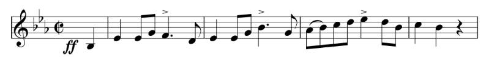

خوش آمدید! در این درس خواهید آموخت که چطور نتهای اول یک قطعه موسیقی (بعنوان مثال، تصویر زیر) را در MEI کدگذاری کنید. 

ضمناً این ملودی، ابتدای قطعه _Hallingdal Bataljons Marsch_، opus 1 از آهنگساز نروژی، [Johan Halvorsen](https://en.wikipedia.org/wiki/Johan_Halvorsen) (1864–1935) است.
