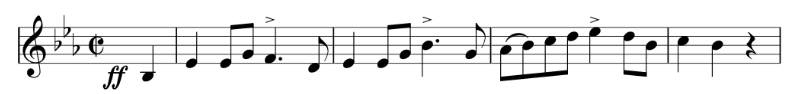

Bienvenue ! Dans ce tutoriel vous apprendrez à encoder un incipit (la séquence de notes initiale d'une œuvre musicale) en MEI, en partant de l'exemple suivant :

Au fait : il s'agit du début de _Hallingdal Bataljons Marsch_, l'Opus 1 du compositeur norvégien [Johan Halvorsen](https://fr.wikipedia.org/wiki/Johan_Halvorsen) (1864–1935).

